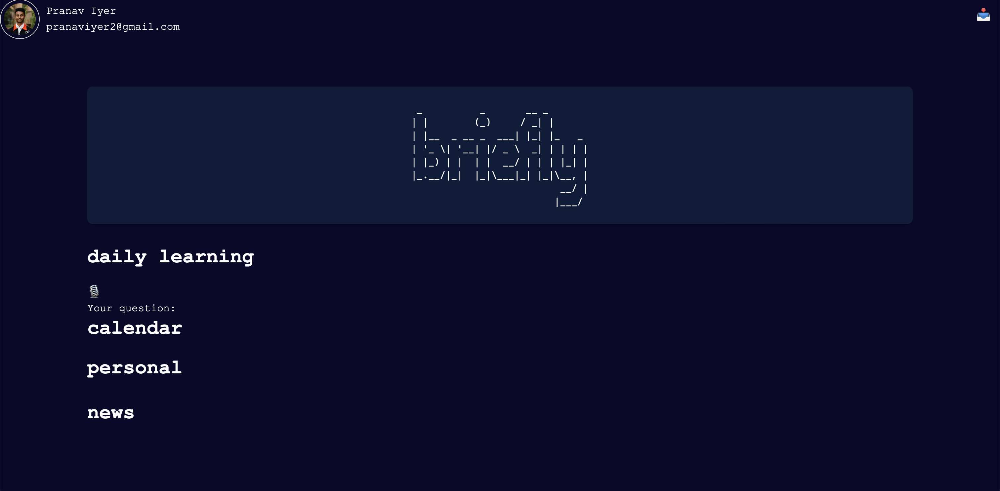
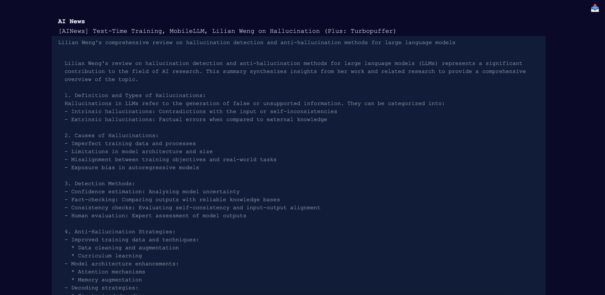
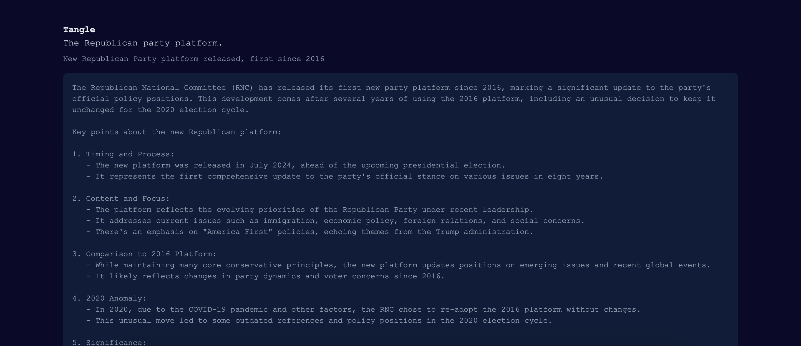
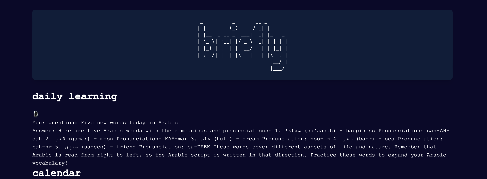

# Briefly-Web
# briefly: your daily presidential briefing.

The idea is to combine calendar look-aheads, email summaries, and the power of language models to provide deep dives via an executive assistant. Got a newsletter talking about advances in RLHF? Ask briefly for a 1 minute deep-dive on that topic. Have a meeting coming up at 7 pm today? Ask briefly for a more in depth view. Want to spend 5 minutes learning a language each morning? Ask briefly for 10 new words to practice.

In the limit, this should run locally, with integrations for iMessage and Notion already in place. Starting to resemble Apple Intelligence...

Note: a web hosted version is running at https://briefly-2ba6d.web.app

Send an email to pranaviyer2@gmail.com to get added to the test users

# Running Locally:

## Frontend: 
cd my-app/hosting and run: npm run dev

## Backend:

You need a credentials.json file which will grant you access to your gmail account progamatically. To do so, you must create a project in the gcloud console, the details of which are not included here.

To run the backend with development and debug settings enabled, create a .env file with the following:

GOOGLE_APPLICATION_CREDENTIALS (Needed)

ANTHROPIC_API_KEY (Needed)

ELEVENLABS_API_KEY (Optional for speech, if you don't want simply comment out in daily_learning.py)

DEBUG=1 (print to terminal)

DEV=1 (indicates local setup)

GOOGLE_SEARCH_API_KEY (Enables google search for Deep Dives)

GOOGLE_SEARCH_CSE_ID (Enables google search for Deep Dives)

```python
./run_local.sh
```

# Images





